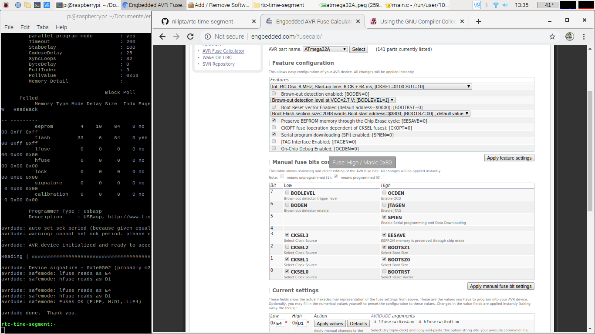

# rtc-time-segment

## here the atmega32 is internal clocked 8 mHZ, and usbasp programmer

//common anode 0 on 1 0ff
//      H      G     F     E     D     C     B     A
//_____________________________________________
//0   0     1     0     0   ||  0     0     0     0           =  40
//1   0     1     1     1   ||  1     0     0     1           =  79   
//2   0     0     1     0   ||  0     1     0     0           =  24
//3   0     0     1     1   ||  0     0     0     0           =   30
//4   0     0     0     1   ||  1     0     0     1           =   19
//5   0     0     0     1   ||  0     0     1     0           =   12
//6   0     0     0     0   ||  0     0     1     0           =   02
//7   0     1     1     1   ||  1     0     0     0           =   78
//8   0     0     0     0   ||  0     0     0     0           =   00
//9   0     0     0     1   ||  0     0     0     0           =   10

/* COMMON ANODE SEVEN SEGMENT
             B   3   2   F   A   1
          __      __      __      __
         |  |    |  |    |  |    |  |
          __      __      __      __
         |  |    |  |    |  |    |  |
          __      __      __      __
             4   G   C   H   D   E
*/
